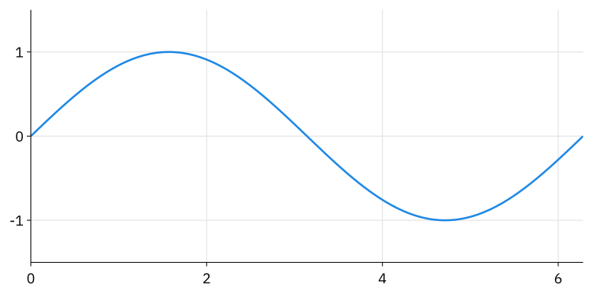

<div align="center">
  <picture>
    <source media="(prefers-color-scheme: dark)" srcset="images/logo-dark.svg" />
    
  </picture>
  <br />
  
  <br /><br />
</div>

<p align="center">
  Make plots, diagrams, math, and slides with JSX.
  <br />
  Render them right from your terminal.
</p>

<p align="center">
  <a href="https://compendiumlabs.ai/gum/studio">Live Demo</a> ·
  <a href="https://compendiumlabs.ai/gum/docs">Documentation</a> ·
  <a href="https://compendiumlabs.ai/gum/gallery">Gallery</a>
</p>

## Install

Gum is a JSX language for vector graphics. The CLI is the fastest way in: write a
figure in a `.jsx` file, render it with `gum`, and keep the source alongside your
project. Output formats include SVG, PNG, PDF, and kitty graphics. Elements, math
functions, colors, and layout helpers are already in scope. The figures above are
Gum output; their sources are [logo.jsx](images/logo.jsx) and [nexus.jsx](images/nexus.jsx).

The current 2.0 prerelease has been tested with Bun 1.4.2 or newer on Linux x64,
macOS, and Windows:

```sh
bun install -g @gum-jsx/cli@beta
```

This installs three commands: `gum` for JSX figures, `gum-tex` for standalone
TeX, and `gum-mark` for Markdown with inline figures. To work from a
[source checkout](https://github.com/CompendiumLabs/gum-jsx#development), run
`bun install` at the workspace root and use `bun run gum` (or the corresponding
`gum-tex` and `gum-mark` scripts).

## Make your first figure

Save this as `plot.jsx`:

```jsx
<Plot
  width={px(750)}
  height={px(375)}
  font-size={px(18)}
  xlim={[0, tau]}
  ylim={[-1.5, 1.5]}
  grid
>
  <SymLine
    fy={sin}
    xlim={[0, tau]}
    samples={161}
    stroke={blue}
    stroke-width={px(2.5)}
  />
</Plot>
```

```sh
gum plot.jsx -o plot.svg
gum plot.jsx -o plot.png --ratio 2
gum plot.jsx -o plot.pdf
gum plot.jsx                 # Display inline in a kitty-compatible terminal
```

<picture>
  <source media="(prefers-color-scheme: dark)" srcset="images/plot-dark.svg" />
  
</picture>

The [source for this plot](images/plot.jsx) is also in this repository. Change
the function, limits, or colors and render it again. Use `px(24)` for pixels,
`em(1.5)` for font-relative lengths, and fractions such as `0.5` for relative
sizes. Start with the [Gum guide](https://github.com/CompendiumLabs/gum-jsx-docs/blob/master/docs/guides/text/gum.md)
and the [element examples](https://github.com/CompendiumLabs/gum-jsx-docs/tree/master/docs/elements/code)
to build beyond this plot.

## Take it further

```sh
gum diagram.jsx -f tree --stats            # Inspect measured layout
gum slides/ -o talk.pdf                    # Turn a slide directory into a PDF
gum-tex 'e^{i\pi}+1=0' -o euler.svg        # Render standalone math
gum-mark README.md                         # Read Markdown with inline graphics
printf '%s\n' '<Square width={px(40)} fill="tomato" />' | gum -f svg
```

`gum` reads from stdin if you omit the input or pass `-`. Input and output paths
are relative to the directory where you run the command. An output extension
selects SVG, PNG, or PDF. For a file or stdin, `gum` defaults to kitty graphics
on stdout; directory input defaults to PDF. Use `-f svg` to send SVG text to
stdout. The full options and the other two
commands are below.

The [Gum workspace](https://github.com/CompendiumLabs/gum-jsx#readme) also has a
browser editor, TypeScript and React APIs, and separate packages for embedding
the renderer. The CLI bundles the renderers you need for these commands.

## Usage

Run `gum [options] [file]` with one input:

| Option | Meaning |
|---|---|
| `file` | One JSX file or deck directory; omit or use `-` for stdin. |
| `-f, --format <format>` | Output format: `kitty`, `svg`, `png`, `pdf`, `tree`, or `json`. Defaults to kitty or the output extension for a file; directories use PDF. |
| `-o, --output <file>` | Write to a file instead of stdout. |
| `-W, --width <pixels>` | Set the viewport width. |
| `-H, --height <pixels>` | Set the viewport height. |
| `--natural` | Measure without the default 640 × 480 offer. |
| `-r, --ratio <number>` | PNG/kitty sampling ratio, default `1`. |
| `--select <x,y,width,height>` | Crop PNG/kitty to a box in source pixels. |
| `-b, --background <color>` | Paint the viewport background. |
| `-t, --theme <theme>` | `light` or `dark`; defaults to the source theme, or dark for kitty and light otherwise. |
| `--title <text>` | Set the SVG or PDF document title. |
| `--id-prefix <name>` | Prefix SVG definition IDs, default `gum`. |
| `--precision <digits\|full>` | Output decimal places from 0 to 100, or `full`; default `10`. |
| `--stats` | Print layout counters to stderr. |
| `-h, --help` | Show command help. |

Omit the input file or use `-` to read stdin. A bare element is wrapped in `Svg`.
`-W` / `--width` and `-H` / `--height` are independent pixel overrides; `-h`
remains the help shortcut. With neither override, `gum` offers 640 × 480 pixels
so unsized canvases can render. This is an advisory budget: explicit source sizes
still win, short content hugs, and tall documents can grow vertically. Use
`--natural` to disable this fallback. With either override, the other axis retains
source sizing or hugs content, allowing `-W 320` to reflow a document and an
aspect ratio to determine a figure's height. `gum-tex` retains natural sizing.
Zero is a valid viewport dimension for SVG, tree, and
JSON; PNG, PDF, and kitty require positive dimensions. The sampling ratio must be
positive and changes raster sampling without changing layout. Raster dimensions
round up to whole pixels.

Use `--select 100,50,200,100 --ratio 3` to crop a 200-by-100-pixel region
starting at `(100, 50)` and render it at 600 by 300 pixels. Coordinates are in
the laid-out source viewport, measured from the top-left. Selection applies to
PNG and kitty output in both commands; other formats report an error. Fractional
coordinates and regions extending outside the image are supported.

An explicit format takes precedence over the output filename. Otherwise the
output extension selects the format. For a file or stdin, stdout defaults to
kitty, including when redirected or piped; directory input defaults to PDF.
Use `-f svg` for SVG on stdout, `-f pdf` for binary PDF on
stdout, or `-o figure.svg` / `-o figure.png` /
`-o figure.pdf` to select a file format automatically.
Kitty output displays inline in terminals that support the kitty graphics
protocol and ends with a newline. An explicit `-f kitty` or an output filename
ending in `.kitty` writes the same graphics sequence.

Rendering defaults to dark for kitty and light for SVG, PNG, PDF, tree, and JSON.
An explicit root `<Svg theme="light|dark">` overrides that default, and
`--theme light|dark` overrides the source root theme. Nested themes and explicit
colors in JSX still apply. Themes do not specify backgrounds. `--background`
paints a backdrop at render time; omit it for transparency. Explicit backgrounds
in JSX still apply and paint over the render backdrop. See
[Themes](https://github.com/CompendiumLabs/gum-jsx-docs/blob/master/docs/guides/text/themes.md) for palettes and semantic paints.

PNG and kitty use node-canvas through `@gum-jsx/png`, loaded only for these
formats. Ordinary text is already SVG glyph paths and needs no font registration.
Emoji remain live SVG text and
depend on the rasterizer's available fonts.

PDF uses `@gum-jsx/pdf`, loaded only for this format. It writes vector
pages sized to their viewports at 96 pixels per inch (0.75 PDF points per pixel).
`--ratio` and `--id-prefix` do not affect PDF output. Text and math remain
outlines, so they are not searchable or selectable; debug overlays are omitted.
`--title` sets PDF document metadata. Named, hex, RGB, and HSL colors are supported;
unsupported paint expressions fail with an error. See the
[PDF API documentation](https://github.com/CompendiumLabs/gum-jsx-pdf/blob/master/README.md) for format limits.

`--precision` sets the decimal places used in SVG, PDF, and tree numeric output;
PNG and kitty use the resulting SVG. Choose an integer from 0 to 100, or `full`
for unrounded JavaScript number strings. It does not change layout geometry.

Errors go to stderr and exit with status 1. `--stats` writes layout counters as
JSON to stderr, one line per rendered page.

Run `bun run typecheck` here to check the CLI, or from the workspace root to
check all packages. Run `bun run test` here for command integration tests, also included in the
workspace test command.

## Multipage PDFs and decks

Pass one directory containing slides to render a multipage PDF:

```sh
gum slides/ -o talk.pdf
gum slides/ > talk.pdf
```

Directory input defaults to PDF; other output formats are rejected. Each slide
becomes one page with its own viewport size; `-W` and `-H` apply to every page.
Long content is not automatically split across pages. The CLI accepts one input
path; put multiple figures in a deck directory to combine them into a PDF.

A directory can contain an optional `index.json`:

```json
{
  "title": "My talk",
  "prelude": "prelude.jsx",
  "slides": ["intro.jsx", "figure.jsx", "conclusion.jsx"]
}
```

All fields are optional. Without `slides`, Gum uses the directory's `.jsx` files
in natural filename order (`slide_2.jsx` before `slide_10.jsx`), excluding the
named prelude. It does not recurse into subdirectories. Manifest paths are
relative to the directory. `title` supplies PDF metadata unless `--title`
overrides it.

The prelude contains shared declarations, such as colors, data, and JSX helpers:

```jsx
const accent = '#369'
function Page({ children }) {
  return (
    <Svg width={px(960)} height={px(540)}>
      <Frame padding={px(32)}>
        {children}
      </Frame>
    </Svg>
  )
}
```

Each prelude is evaluated once per command. Its top-level bindings are available
to each slide, along with the usual core and math helpers. Slides have separate
local declarations and may be bare JSX or JavaScript that returns an element.
Manifest and prelude handling applies to directory input. A single file or stdin
uses ordinary core and math bindings without loading neighboring `index.json`
files. A slide rendered as an individual file must be self-contained. Pass the
deck directory to use its prelude.

## Development and visual reports

The artwork at the top of this page is generated from the JSX in `images/`.
From this package's directory, regenerate it with:

```sh
bun run gum images/logo.jsx -o images/logo.svg
bun run gum images/logo.jsx --theme dark -o images/logo-dark.svg
bun run gum images/nexus.jsx -o images/nexus.svg
bun run gum images/plot.jsx -o images/plot.svg
bun run gum images/plot.jsx --theme dark -o images/plot-dark.svg
```

From the workspace root, `bun run visual-test` evaluates every element and topic
example in `gum-jsx-docs` plus its focused visual regression cases. It checks for
evaluation/layout failures, empty viewports, non-finite SVG geometry, and empty
drawings, then writes a searchable, self-contained report to
`gum-jsx-cli/visual-report/dist/index.html`. The report includes each SVG, its
source, dimensions, timing, status filters, deep links, and light/dark page chrome.

`bun run visual-report` is an alias. The HTML opens directly from disk; for an HTTP
preview, run `bun --filter @gum-jsx/cli visual-report:serve`. Pass
`--output /some/directory` after the package script to change the generated output
directory. The checked-in report notes are in
[visual-report/README.md](./visual-report/README.md).

The protocol encoders in [src/kitty.ts](./src/kitty.ts) accept PNG or raw RGBA
data, with image/placement IDs, terminal columns/rows, cursor movement, and
virtual-placement controls. `@gum-jsx/mark` adds virtual image placements and
Unicode placeholder grids for pager output.

Watch mode remains
tracked in [FEATURES.md](https://github.com/CompendiumLabs/gum-jsx/blob/master/docs/FEATURES.md#command-line-and-authoring-workflows).

## Markdown terminal output

```sh
gum-mark README.md
gum-mark notes.md -t light -H 120
gum-mark notes.md -p
printf 'Inline math: $x^2$\n' | gum-mark
```

`gum-mark` renders headings and inline Markdown as ANSI text. Fenced `gum` or
`gum.jsx` blocks, local `.jsx`, `.svg`, and `.png` images, and `$...$` or
`$$...$$` math become kitty graphics. Fence metadata and image alt text accept
`width=`, `height=`, and `theme=` overrides. `--pager` sends virtual image
placements to the terminal and passes their Unicode placeholder grids through
`less -R`.

## Standalone TeX

```sh
gum-tex 'e^{i\pi}+1=0' -o /tmp/euler.svg
gum-tex 'e^{i\pi}+1=0' -o /tmp/euler.pdf
gum-tex '\frac{a+b}{c+d}' -s 48 -p 0.25 -o /tmp/fraction.png --ratio 2
gum-tex -i formula.tex --inline -f tree --stats
printf '%s\n' '\int_0^1 x^2\,dx=\frac13' | gum-tex -f svg
gum-tex 'x^2' --fit -W 320
gum-tex 'x^2' --theme dark
gum-tex 'x^2' -t light --background white -o /tmp/formula.png
gum-tex --help
```

The `gum-tex` positional argument is literal TeX. Omit it or use `-` for stdin; use `-i` / `--input` for a file.
Literal input and `--input` are mutually exclusive. Supply formula contents
without `$` or `$$` delimiters. Quote shell input with single quotes to preserve
backslashes; use `--` before a formula starting with a dash.

The shared output options above apply to both commands; `--natural` is JSX-only. TeX adds:

| Option | Meaning |
|---|---|
| `-s, --font-size <pixels>` | Positive base em, default `64`. |
| `-p, --padding <em>` | Nonnegative padding on each side, default `0`. |
| `--inline` | Text style; the default is display style. |
| `--no-strut` | Omit the minimum formula line box. |
| `--color <color>` | Formula color, default theme foreground (white for dark, black for light). |
| `--macro <command=tex>` | Repeatable definition, such as `'\RR=\mathbb{R}'`. |
| `--fit` | Allow enlargement into `-W` and/or `-H`; the default only shrinks. |
| `--no-fit` | Keep the original formula size and clip to the viewport. |

Natural exports use `mathToElement` from `@gum-jsx/math`: logical space and all
visible ink are included, with negative extents translated into the viewport.
Empty axes have a one-pixel floor. This preserves italic overhang, accents,
laps, and smashed ink without changing their typographic advance inside other
layouts. `gum` and `gum-tex` share layout, inspection, SVG, PNG, PDF, and kitty output.

Font size controls typography. `-W` / `-H` shrink the formula when necessary;
`--fit` also allows enlargement and requires at least one dimension. `--no-fit`
keeps the formula unscaled and clips it to the viewport.
`--ratio` controls raster resolution independently. Errors retain the formula's
layout path and TeX source range when available; malformed and unsupported TeX
exit with status 1. No JavaScript evaluation is used for TeX input.

See the [standalone export guide](https://github.com/CompendiumLabs/gum-jsx-docs/blob/master/docs/guides/text/math_export.md) for
synchronous/asynchronous library helpers and font-resource ownership.
