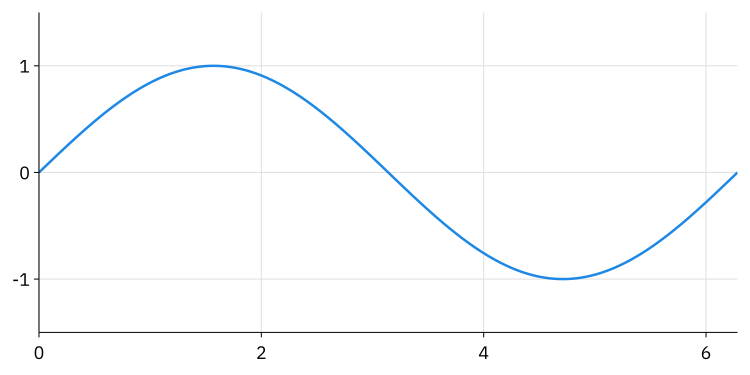

<div align="center">
  <picture>
    <source media="(prefers-color-scheme: dark)" srcset="images/logo-dark.svg" />
    
  </picture>
  <br />
  
  <br /><br />
</div>

<p align="center">
  Make plots, diagrams, math, and slides with JSX.
  <br />
  Render them right from your terminal.
</p>

<p align="center">
  <a href="https://compendiumlabs.ai/gum/studio">Live Demo</a> ·
  <a href="https://compendiumlabs.ai/gum/docs">Documentation</a> ·
  <a href="https://compendiumlabs.ai/gum/gallery">Gallery</a>
</p>

## Install

Gum is a JSX language for vector graphics. The CLI is the fastest way in: write a
figure in a `.jsx` file, render it with `gum`, and keep the source alongside your
project. Output formats include SVG, PNG, PDF, PPTX, MP4, and kitty graphics. Elements, math
functions, colors, and layout helpers are already in scope. The figures above are
Gum output; their sources are [logo.jsx](images/logo.jsx) and [nexus.jsx](images/nexus.jsx).

The bundled npm CLI requires Node.js 24 or newer. Install it with:

```sh
npm install -g @gum-jsx/cli
```

The npm package contains a prebuilt JavaScript bundle, fonts, map data, and the
PNG and MP4 renderers. It has no runtime package dependencies. Bun 1.4.2 or newer works
equally well as an alternative runtime.

This installs `gum` for JSX figures. To work from a
[source checkout](https://github.com/CompendiumLabs/gum-jsx#development), run
`bun install` and `bun --filter @gum-jsx/png build` at the workspace root,
then use `bun gum-jsx-cli/src/cli.ts`.
Rebuild `@gum-jsx/png` after changing its source; this uses the checked-in WASM
artifact and requires no Rust toolchain.

### Build the npm package

From this package's directory, run `bun run build` to generate `dist/npm/`.
`npm pack` and `npm publish` run this build automatically through `prepack`.
The package ships only this bundle and its assets/notices, plus the README and
license. Builds preserve class names used in layout diagnostics and share the
Acorn deduplication used by standalone executables.

Run `bun test test/package.test.ts` to pack the CLI, install it offline in a
fresh project with lifecycle scripts disabled, and run command tests under Node
and Bun. Node rendering is tested with an empty `PATH`. Set `GUM_NODE_RUNTIME`
to test a specific Node executable.

### Standalone executable

From this package's directory, build `gum` with Bun 1.4.2 or newer. With no
options, the script builds macOS ARM64 and x64, Windows x64, and Linux x64:

```sh
bun run standalone:build
```

The outputs are `dist/gum-macos-arm64`, `dist/gum-macos-x64`, `dist/gum-windows-x64.exe`, and
`dist/gum-linux-x64`. Select one target with `--target`; optionally override its
output path with `--outfile`:

```sh
bun run standalone:build --target bun-linux-x64
bun run standalone:build --target=bun-darwin-arm64 --outfile dist/gum-macos
```

The executable includes the Bun runtime, core and math fonts, map data, and the
PNG and MP4 WebAssembly renderers. Users need no Bun installation or `node_modules` for
rendering. This build produces only `gum`.

For a local build using the installed Bun runtime, or to test a release executable:

```sh
bun run standalone:build --target native
./dist/gum figure.jsx -o figure.png
GUM_STANDALONE_BINARY="$PWD/dist/gum-linux-x64" bun test ./test/standalone.test.ts
```

Bun downloads the requested runtime when needed. Build a separate executable for
each OS/architecture using [Bun's supported targets](https://bun.sh/docs/bundler/executables).
The `native` target uses the installed Bun runtime, so distro builds can introduce
extra shared-library dependencies; check release artifacts with `ldd` on Linux.
The script uses Bun's `baseline` alias for `bun-linux-x64` to select the official
download instead of reusing an identically targeted distro runtime in Bun 1.4.2.
The official Linux x64 baseline build tested here needs glibc and standard system
libraries, but no ICU installation. It is approximately 83 MiB (37 MiB gzipped)
with Bun 1.4.2. Other platforms still need native testing before release.

The build minifies whitespace and syntax while preserving identifier names used
in inspection output and diagnostics. Standalone tests copy the executable to a
temporary directory, clear `PATH`, and compare all output formats with the source
CLI, including fonts, maps, and decks. They build only the native target
and run as part of `bun run test`;
`GUM_STANDALONE_BINARY` can select an already-built executable instead.

### Release archives

Build and package the four default targets for manual upload to GitHub Releases:

```sh
bun run standalone:pack
```

This writes these files to `dist/releases/v<package-version>/`:

```text
gum-v<version>-macos-arm64.tar.gz
gum-v<version>-macos-x64.tar.gz
gum-v<version>-linux-x64.tar.gz
gum-v<version>-windows-x64.zip
SHA256SUMS
```

Each archive extracts into its own named directory containing `gum` (or
`gum.exe`), installation notes, the project license, and dependency/font/data
notices. Unix archives preserve the executable permission. Packaging requires
`tar` and `zip` on the build machine; the executables do not require these tools.

The same target and output options apply. For example:

```sh
bun run standalone:pack --target bun-linux-x64
```

This rebuilds and packages just that target, retaining the other archives in the
version directory and refreshing `SHA256SUMS` for all of them. Only include
archives you intend to release in that directory. Upload its archives and
`SHA256SUMS` manually; the command does not publish anything or sign binaries.
Checksums can be verified with `sha256sum -c SHA256SUMS` on Linux, or
`shasum -a 256 -c SHA256SUMS` on macOS.

## Make your first figure

Save this as `plot.jsx`:

```jsx
<Plot
  width={px(750)}
  height={px(375)}
  font-size={px(18)}
  xlim={[0, tau]}
  ylim={[-1.5, 1.5]}
  grid
>
  <SymLine
    fy={sin}
    xlim={[0, tau]}
    samples={161}
    stroke={blue}
    stroke-width={px(2.5)}
  />
</Plot>
```

```sh
gum plot.jsx -o plot.svg
gum plot.jsx -o plot.svg --text-mode live
gum plot.jsx -o plot.png --ratio 2
gum plot.jsx -o plot.png --png-encoding standard
gum plot.jsx -o plot.pdf
gum plot.jsx                 # Display inline in a kitty-compatible terminal
```

<picture>
  <source media="(prefers-color-scheme: dark)" srcset="images/plot-dark.svg" />
  
</picture>

The [source for this plot](images/plot.jsx) is also in this repository. Change
the function, limits, or colors and render it again. Use `px(24)` for pixels,
`em(1.5)` for font-relative lengths, and fractions such as `0.5` for relative
sizes. Start with the [Gum guide](https://github.com/CompendiumLabs/gum-jsx-docs/blob/master/docs/guides/text/gum.md)
and the [element examples](https://github.com/CompendiumLabs/gum-jsx-docs/tree/master/docs/elements/code)
to build beyond this plot.

## Take it further

PNG and kitty output use fast lossless encoding by default. Set
`--png-encoding standard` to use the previous compression policy. Both presets
preserve the same decoded pixels; encoded file sizes vary by image.

```sh
gum diagram.jsx -f tree --stats            # Inspect measured layout
gum slides/ -o talk.pdf                    # Turn a slide directory into a PDF
printf '%s\n' '<Square width={px(40)} fill="tomato" />' | gum -f svg
```

`gum` reads from stdin if you omit the input or pass `-`. Input and output paths
are relative to the directory where you run the command. An output extension
selects SVG, PNG, PDF, or PPTX. For a file or stdin, `gum` defaults to kitty graphics
on stdout; directories and multiple files default to PDF. Use `-f svg` to send SVG text to
stdout. The full options are below.

The [Gum workspace](https://github.com/CompendiumLabs/gum-jsx#readme) also has a
browser editor, TypeScript and React APIs, and separate packages for embedding
the renderer. The CLI bundles the renderers you need for this command.

## Usage

Run `gum [options] [files...]`:

| Option | Meaning |
|---|---|
| `files...` | JSX files or one deck directory; omit or use `-` for stdin. |
| `-f, --format <format>` | Output format: `kitty`, `svg`, `png`, `pdf`, `pptx`, `mp4`, `tree`, or `json`. Defaults to kitty or the output extension for a file; directories and multiple files require PDF or PPTX. |
| `-o, --output <file>` | Write to a file instead of stdout. |
| `--time <seconds>` | Preview one video frame; defaults to 0. Omit for MP4 export. |
| `--qp <number>` | MP4 quantizer, 10–51; lower is higher quality. Default: 18. |
| `-W, --width <pixels>` | Set the viewport width. |
| `-H, --height <pixels>` | Set the viewport height. |
| `-r, --ratio <number>` | PNG/kitty sampling ratio, default `1`. |
| `--select <x,y,width,height>` | Crop PNG/kitty to a box in source pixels. |
| `-b, --background <color>` | Paint the viewport background. |
| `-t, --theme <theme>` | `light` or `dark`; defaults to the source theme, or dark for kitty and light otherwise. |
| `--title <text>` | Set the SVG, PDF, or PPTX document title. |
| `--id-prefix <name>` | Prefix SVG definition IDs, default `gum`. |
| `--precision <digits\|full>` | Output decimal places from 0 to 100, or `full`; default `10`. |
| `--text-mode <path\|live\|mixed>` | Text and math in SVG/PDF/PPTX. `mixed` keeps prose live and math outlined. Defaults to `path` for SVG, `live` for PDF, and `mixed` for PPTX. PNG, kitty, and MP4 always use paths. |
| `--stats` | Print layout counters to stderr. |
| `-h, --help` | Show command help. |

Omit the input file or use `-` to read stdin. A bare element is wrapped in `Svg`.
`-W` / `--width` and `-H` / `--height` are independent pixel overrides; `-h`
remains the help shortcut. With neither override, `gum` offers 640 × 480 pixels
so unsized canvases can render. This is an advisory budget: explicit source sizes
still win, short content hugs, and tall documents can grow vertically.
With either override, the other axis retains
source sizing or hugs content, allowing `-W 320` to reflow a document and an
aspect ratio to determine a figure's height.
Zero is a valid viewport dimension for SVG, tree, and
JSON; PNG, PDF, and kitty require positive dimensions. The sampling ratio must be
positive and changes raster sampling without changing layout. Raster dimensions
round up to whole pixels.

Use `--select 100,50,200,100 --ratio 3` to crop a 200-by-100-pixel region
starting at `(100, 50)` and render it at 600 by 300 pixels. Coordinates are in
the laid-out source viewport, measured from the top-left. Selection applies to
PNG and kitty output; other formats report an error. Fractional
coordinates and regions extending outside the image are supported.

An explicit format takes precedence over the output filename. Otherwise the
output extension selects the format. For a file or stdin, stdout defaults to
kitty, including when redirected or piped; directories and multiple files default to PDF.
Use `-f svg` for SVG on stdout, `-f pdf` for binary PDF on
stdout, or `-o figure.svg` / `-o figure.png` /
`-o figure.pdf` to select a file format automatically.
Kitty output displays inline in terminals that support the kitty graphics
protocol and ends with a newline. An explicit `-f kitty` or an output filename
ending in `.kitty` writes the same graphics sequence.

Rendering defaults to dark for kitty and light for SVG, PNG, PDF, PPTX, tree, and JSON.
An explicit root `<Svg theme="light|dark">` overrides that default, and
`--theme light|dark` overrides the source root theme. Nested themes and explicit
colors in JSX still apply. Themes do not specify backgrounds. `--background`
paints a backdrop at render time; omit it for transparency. Explicit backgrounds
in JSX still apply and paint over the render backdrop. See
[Themes](https://github.com/CompendiumLabs/gum-jsx-docs/blob/master/docs/guides/text/themes.md) for palettes and semantic paints.

PNG and kitty render fragments through `@gum-jsx/png` and tiny-skia WebAssembly.
Outlined text, math, shapes, and embedded PNGs need no native addons or install
scripts.
`--text-mode live` preserves text and math as live SVG text. SVG viewers need
matching fonts; the option does not embed or install them in SVG. PNG and kitty
always request glyph outlines regardless of that flag. Emoji without outlines
cannot be rasterized; export SVG to display them in a browser with suitable fonts.
`--background` also fills any area of a PNG crop outside the figure viewport.

PDF uses `@gum-jsx/pdf`. It writes vector
pages sized to their viewports at 96 pixels per inch (0.75 PDF points per pixel).
`--ratio` and `--id-prefix` do not affect PDF output. Text and math glyphs default
to selectable native text with embedded font subsets shared across all pages.
`--text-mode path` exports outlines instead. Math decorations remain vector
geometry, and copying formulas does not reconstruct TeX. Debug overlays are omitted.
`--title` sets PDF document metadata. Named, hex, RGB, and HSL colors are supported;
unsupported paint expressions fail with an error. See the
[PDF API documentation](https://github.com/CompendiumLabs/gum-jsx-pdf/blob/master/README.md) for format limits.

PPTX uses `@gum-jsx/pptx` to write native vector shapes and embedded PNG pictures.
Use `gum figure.jsx -o figure.pptx` or `gum slides/ -o talk.pptx`. The default
`mixed` mode uses selectable, editable prose with fixed line breaks and styled
runs, plus outlined math that needs no installed math fonts. Prose fonts are
referenced without embedding; the viewer needs matching fonts. Use `--text-mode live`
for editable math glyphs too, or `--text-mode path` for all outlines. Slides have a
white base, must share one size, and must
measure 96–5376 pixels per side at the default physical scale. Fragment clips are
ignored, so content outside them is exported in full. Skewed images,
reflected/skewed/nonuniformly scaled live text,
nonuniformly transformed strokes, and combined
fill/stroke opacity are deferred and produce clear errors. `--ratio`, `--precision`,
and `--id-prefix` do not affect PPTX. See the [PPTX API](../gum-jsx-pptx/README.md).

`--precision` sets the decimal places used in SVG, PDF, and tree numeric output;
PNG and kitty rendering use the full layout geometry. Choose an integer from
0 to 100, or `full` for unrounded JavaScript number strings. It does not change
layout geometry.

Errors go to stderr and exit with status 1. `--stats` writes layout counters as
JSON to stderr, one line per rendered page.

Run `bun run typecheck` here to check the CLI, or from the workspace root to
check all packages. Run `bun run test` here for command integration tests, also included in the
workspace test command.

## MP4 animations

Return a video description from a JSX source: `size: [width, height]`, `fps`,
`duration` in seconds, optional `background`, and a synchronous
`frame: ({time, frame, fps}) => element` function. Core, math, map, and plugin
bindings remain available, plus `lerp`, `progress`, and `ease_in_out` helpers.

```sh
gum orbit.jsx -o orbit.mp4                # Export the complete animation
gum orbit.jsx -f mp4 > orbit.mp4          # Stream MP4 to stdout
gum orbit.jsx --time 1.5                 # Kitty preview (defaults to time 0)
gum orbit.jsx --time 1.5 -o frame.png     # Save a frame
gum orbit.jsx -o orbit.mp4 --qp 16        # Higher quality (default quantizer: 18)
```

Frame previews also support SVG, PDF, PPTX, tree, and JSON output. `--time`
selects `floor(time * fps)` and must be nonnegative and less than the duration.
Omit it when exporting MP4. `-W`, `-H`, `--theme`, and `--background` override the
video's viewport and appearance; previews use the same source dimensions and
background as the movie. MP4 requires even dimensions from 2 to 4096.

Encoding uses the bundled `@gum-jsx/mp4` Rust/WASM backend; FFmpeg is not needed.
`--qp` accepts integers 10–51, with lower values giving larger, higher-quality
files. Output is H.264 in fragmented MP4, with no audio. Directory and multi-file
inputs remain PDF/PPTX only. MP4 does not support `--ratio`, `--select`, or
`--stats`; use `-W`/`-H` for video dimensions. File exports preserve an existing
destination on failure; stdout may contain a partial stream if rendering fails.

See the [MP4 package](https://github.com/CompendiumLabs/gum-jsx-mp4) for the source
format, encoder API, and limitations.

## PDF and PowerPoint decks

Pass JSX files in slide order or one directory containing slides to render a PDF or PPTX:

```sh
gum intro.jsx figure.jsx conclusion.jsx -o talk.pdf
gum slides/ -o talk.pdf
gum slides/ -o talk.pptx
gum slides/ > talk.pdf
```

Directories and multiple files default to PDF and also accept PPTX. PDF pages
retain their own viewport sizes; PPTX slides must all have the same size.
`-W` and `-H` apply to every slide.
Long content is not automatically split across pages. Directories and stdin
cannot be combined with other inputs.

A directory can contain an optional `index.json`:

```json
{
  "title": "My talk",
  "prelude": "prelude.jsx",
  "slides": ["intro.jsx", "figure.jsx", "conclusion.jsx"]
}
```

All fields are optional. Without `slides`, Gum uses the directory's `.jsx` files
in natural filename order (`slide_2.jsx` before `slide_10.jsx`), excluding the
named prelude. It does not recurse into subdirectories. Manifest paths are
relative to the directory. `title` supplies PDF/PPTX metadata unless `--title`
overrides it.

The prelude contains shared declarations, such as colors, data, and JSX helpers:

```jsx
const accent = '#369'
function Page({ children }) {
  return (
    <Svg width={px(960)} height={px(540)}>
      <Frame padding={px(32)}>
        {children}
      </Frame>
    </Svg>
  )
}
```

Each prelude is evaluated once per command. Its top-level bindings are available
to each slide, along with the usual core and math helpers. Slides have separate
local declarations and may be bare JSX or JavaScript that returns an element.
Manifest and prelude handling applies to directory input. Explicit files or stdin
uses ordinary core and math bindings without loading neighboring `index.json`
files. A slide rendered as an individual file must be self-contained. Pass the
deck directory to use its prelude.

## Development and visual reports

The artwork at the top of this page is generated from the JSX in `images/`.
From this package's directory, regenerate it with:

```sh
bun run gum images/logo.jsx -o images/logo.svg
bun run gum images/logo.jsx --theme dark -o images/logo-dark.svg
bun run gum images/nexus.jsx -o images/nexus.svg
bun run gum images/plot.jsx -o images/plot.svg
bun run gum images/plot.jsx --theme dark -o images/plot-dark.svg
```

From the workspace root, `bun run visual-test` evaluates every element and topic
example in `gum-jsx-docs` plus its focused visual regression cases. It checks for
evaluation/layout failures, empty viewports, non-finite SVG geometry, and empty
drawings, then writes a searchable, self-contained report to
`gum-jsx-cli/visual-report/dist/index.html`. The report includes each SVG, its
source, dimensions, timing, status filters, deep links, and light/dark page chrome.

`bun run visual-report` is an alias. The HTML opens directly from disk; for an HTTP
preview, run `bun --filter @gum-jsx/cli visual-report:serve`. Pass
`--output /some/directory` after the package script to change the generated output
directory. The checked-in report notes are in
[visual-report/README.md](./visual-report/README.md).

The protocol encoders in [src/kitty.ts](./src/kitty.ts) accept PNG or raw RGBA
data, with image/placement IDs, terminal columns/rows, cursor movement, and
virtual-placement controls.

Watch mode remains
tracked in [FEATURES.md](https://github.com/CompendiumLabs/gum-jsx/blob/master/docs/FEATURES.md#command-line-and-authoring-workflows).
